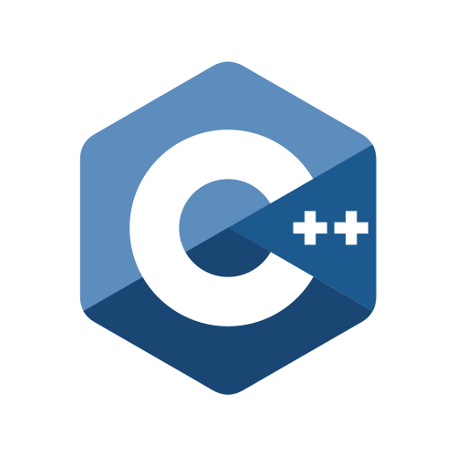
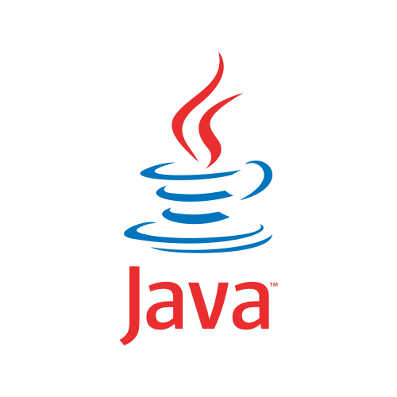

## ⚜️ Angelos T. Dimoglis ⚜️

Hi there! I'm a passionate software engineer who thrives on building reliable, scalable, and elegant systems. My interests span across the full spectrum of software—from writing efficient code to automating infrastructure and everything in between.

## 📚 Areas Of Interest

* Software Engineering 
* Software Architecture
* DevOps And Automation
* Cloud Computing And Distributed Systems
* Programming Languages

##  💻 Tech Stack

### Programming Languages

    
    
    
    

### Scripting Languages

    
    
    

 

## 📊 GitHub Stats

<!-- GitHub Stats -->

    

 

<!-- Top Languages -->

    

 

<!-- GitHub Streak -->

  

